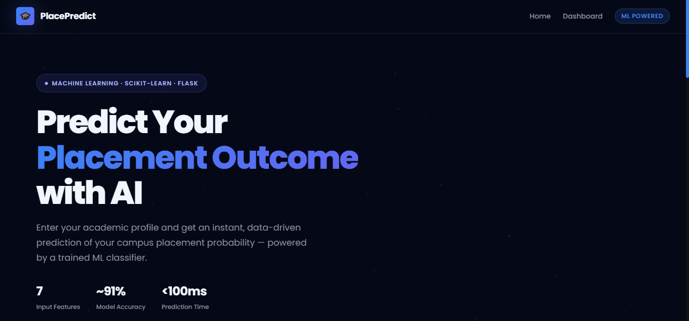
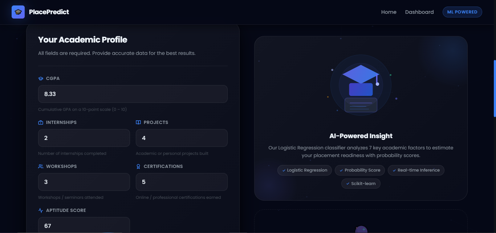
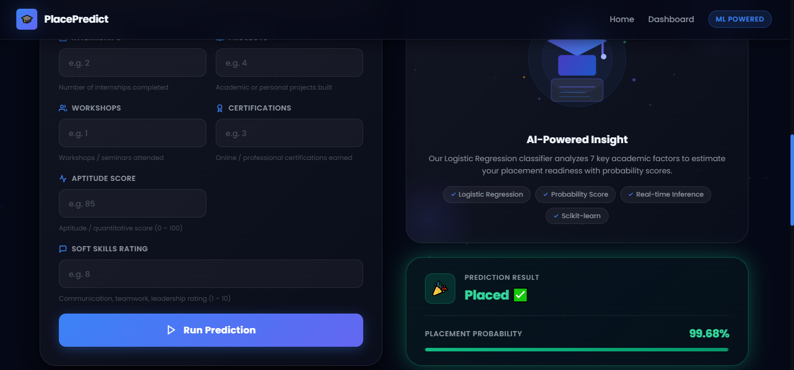
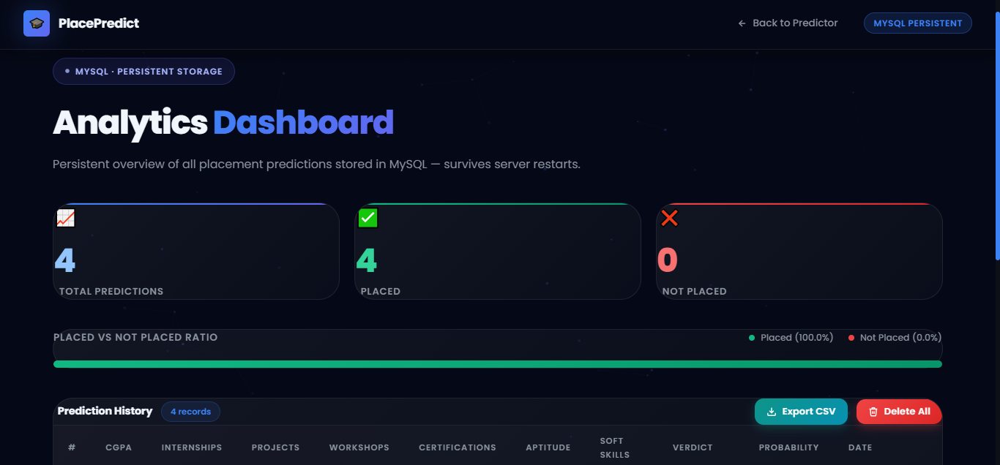
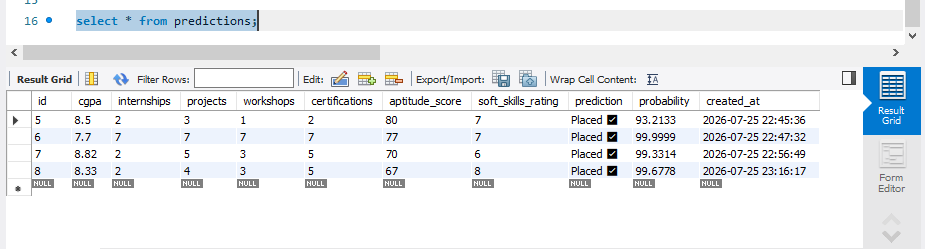
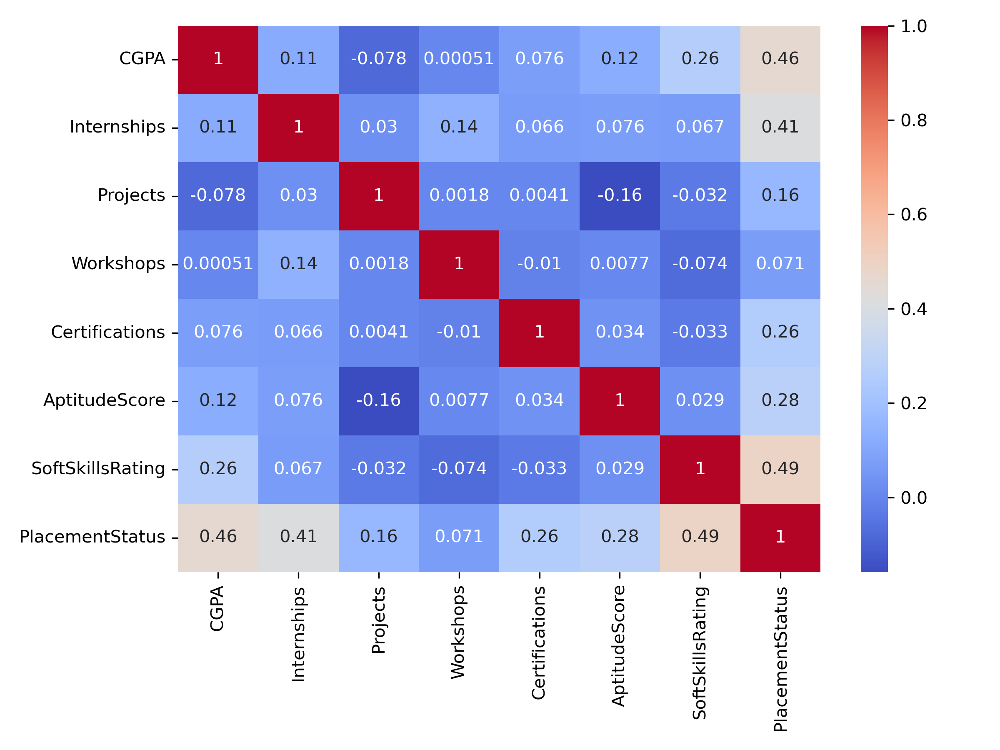
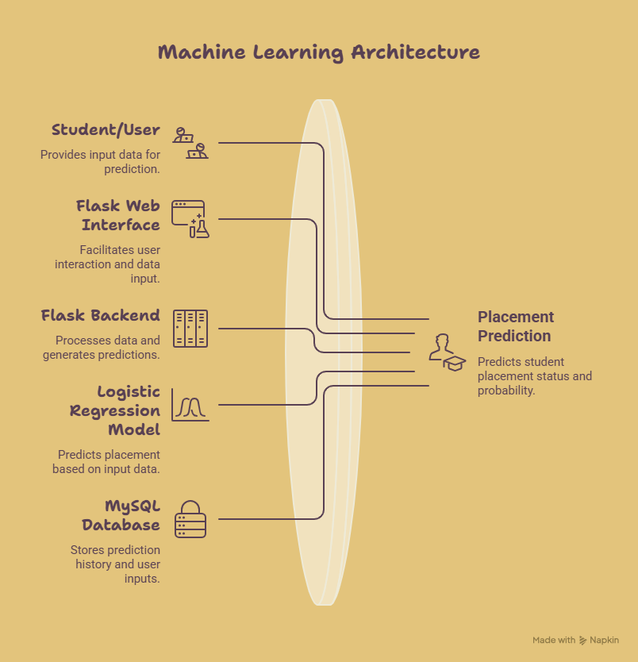
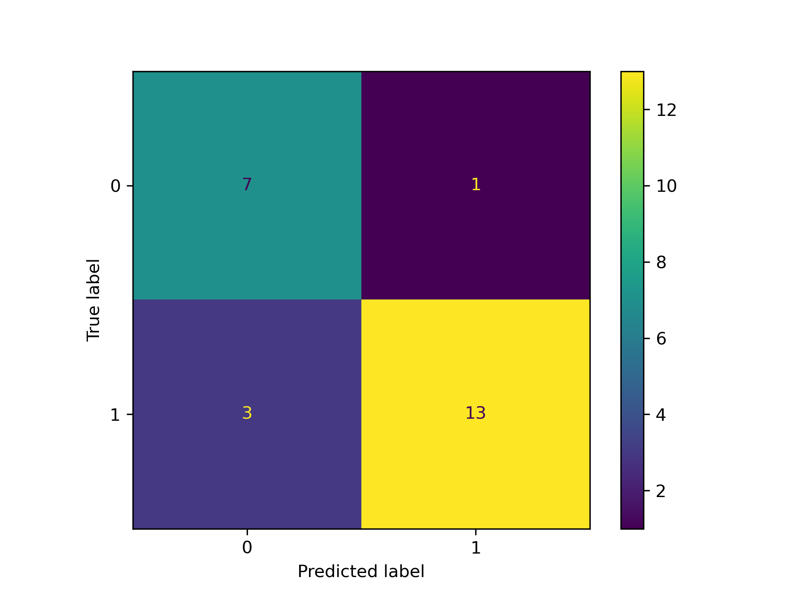

# 🚀 Placement Prediction System

A modern Machine Learning-powered web application that predicts whether a student is likely to be placed based on academic performance, internships, projects, certifications, aptitude score, and soft skills.

Built using **Python, Flask, Scikit-learn, MySQL, HTML, CSS, and JavaScript**, this project demonstrates the complete Machine Learning workflow from data preprocessing to deployment.

---

# 🌟 Features

- 🎯 Predict placement chances using Machine Learning
- 📊 Interactive and modern user interface
- 🧠 Logistic Regression prediction model
- 📈 Placement probability prediction
- 🗄️ MySQL database integration
- 📋 Dashboard to view prediction history
- 📱 Fully responsive design

---

# 🛠 Tech Stack

- Python
- Flask
- Scikit-learn
- Pandas
- NumPy
- MySQL
- HTML5
- CSS3
- JavaScript

---

# 📂 Project Structure

```
Placement-Prediction-System/
│
├── static/
│   ├── css/
│   └── js/
│
├── templates/
│   ├── index.html
│   └── dashboard.html
│
├── screenshots/
│
├── placement_model.pkl
├── app.py
├── requirements.txt
└── README.md
```

---

# 📷 Project Screenshots

## 🏠 Home Page



---

## ✍️ Prediction Form



---

## ✅ Prediction Result



---

## 📊 Dashboard



---

## 🗄️ Database



---

## 📉 EDA



---

## 🤖 Model Performance



---

## 📌 Confusion Matrix



---

# 📈 Model Information

Algorithm Used

- Logistic Regression

Model Accuracy

- **88%**

Evaluation Metrics

- Accuracy Score
- Confusion Matrix

---

# ⚙️ Installation

Clone the repository

```bash
git clone https://github.com/harshrana910/placement-prediction-system.git
```

Move into the project

```bash
cd placement-prediction-system
```

Install dependencies

```bash
pip install -r requirements.txt
```

Run Flask application

```bash
python app.py
```

---

# Future Improvements

- Random Forest
- XGBoost
- User Authentication
- Cloud Deployment
- Email Notifications
- Analytics Dashboard

---

# 👨‍💻 Author

**Harsh Rana**

MSc IT (Data Analytics & AI)

GitHub:
https://github.com/harshrana910

LinkedIn:
https://linkedin.com/in/harshrana2004

---

⭐ If you like this project, don't forget to star the repository.